<h1 align="center">404 Solutions - Aplicación React con Dashboard </h1>

<p align="center">
  
  
  
  
  
  
  
</p>

## Deploy en Producción

**Sitio Web:** [https://404-solutions-fe.vercel.app/](https://404-solutions-fe.vercel.app/)


---

## 📚 Descripción del Proyecto

Este proyecto es la **migración completa** del sitio web estático de 404 Solutions (TP1) a una **Single Page Application (SPA)** moderna desarrollada con React. La aplicación implementa una arquitectura de componentes reutilizables, navegación mediante React Router, y un sistema de Dashboard con Sidebar fija para una experiencia de usuario profesional.

### Objetivo

Demostrar el dominio de React mediante la implementación de:

- Arquitectura de componentes modular
- Gestión de estado con Hooks
- Consumo de datos locales (JSON) y APIs externas
- Navegación SPA con React Router
- Interfaz interactiva con Lightbox y paginación
- Dashboard profesional con Sidebar fija

---

## 👥 Integrantes del Equipo

| Nombre                  | Rol                         | GitHub                                                 |
| ----------------------- | --------------------------- | ------------------------------------------------------ |
| **Mariana Aiello**      | Software Dev & Data Science | [github.com/Aiello-M](https://github.com/Aiello-M)     |
| **Mario González**      | Full Stack Developer        | [github.com/elavincho](https://github.com/elavincho)   |
| **Miguel Ángel Flores** | Full Stack Developer        | [github.com/mikefink22](https://github.com/mikefink22) |
| **Raquel Rodríguez**    | Frontend Developer          | [github.com/raquerh](https://github.com/raquerh)       |
| **Valeria Thomas**      | Fullstack Developer         | [github.com/Irinath](https://github.com/Irinath)       |

---

## 🛠️ Tecnologías Utilizadas

### Frontend Framework

- **React** 19.2.5 - Librería de UI con componentes funcionales y Hooks
- **React Router DOM** 7.1.3 - Navegación SPA sin recarga de página
- **Vite** 8.0.10 - Build tool ultrarrápido y servidor de desarrollo con HMR (Hot Module Replacement)

### Herramientas de Desarrollo

- **ESLint** 10.2.1 - Linter para análisis de calidad y consistencia de código estático.
- **Git** - Control de versiones
- **npm** - Gestor de paquetes

### Lenguajes y Estilos

- **JavaScript (ES6+)** - Lógica dinámica con arrow functions, destructuring y asincronismo (fetch/promises, async/await)
- **CSS3** - Variables CSS, Flexbox, Grid, Animaciones, Transiciones y Media Queries.
- **HTML5** - Estructura semántica base en `index.html`.

### Recursos Externos

- #### Tipografías
  - **Google Fonts** - [JetBrains Mono](https://fonts.google.com/specimen/JetBrains+Mono) - Fuente monoespaciada principal
  - **Google Fonts** - [Fira Code](https://fonts.google.com/specimen/Fira+Code) - Fuente general utilizada en el perfil de Raquel
  - **Google Fonts** - [Syne](https://fonts.google.com/specimen/Syne) - Fuente de títulos utilizada en el perfil de Raquel

- #### Librerías de Iconos
  - **DevIcons** - Iconos de tecnologías y lenguajes de programación
  - **Font Awesome** 6.5.1 - Iconos generales para UI

- #### API Externa

* **iTunes Search API** - API pública de Apple para búsqueda de música (<https://itunes.apple.com/search>)

---

## 📁 Estructura de Archivos

```text
404Solutions_FE/
├── public/                      # Archivos estáticos y base de datos local
│   ├── data/
│   │   └── projects.json       # Datos locales (20 proyectos)
│   ├── img/                    # Recursos gráficos y GIFs para README
│   │   ├── discos-mariana/
│   │   ├── discos-mario/
│   │   ├── discos-mike/
│   │   ├── discos-raquel/
│   │   ├── iconos-mario/
│   │   ├── img-valeria/
│   │   ├── peliculas-mariana/
│   │   ├── peliculas-raquel/
│   │   ├── proyectos-mariana/
│   │   ├── proyectos-mario/
│   │   ├── proyectos-raquel/
│   │   ├── proyectos-valeria/
│   │   ├── readme-img/         # Capturas para documentación
│   │   └── tecnologias-mario/
│   │   └── tecnologias-valeria/
│   │   └── ...
│   └── logo404solution.ico
│   │
├── src/
│   ├── components/            # Componentes de interfaz reutilizables
│   │   ├── AdvancedBar.jsx    # Barra segmentada animada interactiva
│   │   ├── AdvancedBar.css
│   │   ├── Footer.jsx         # Pie de página con año dinámico
│   │   ├── Footer.css
│   │   ├── Header.jsx         # Controlador de menú móvil
│   │   ├── Header.css
│   │   ├── HeroSection.jsx    # Sección hero con animaciones
│   │   ├── HeroSection.css
│   │   └── ScrollToTop.jsx    # Scroll automático en navegación
│   │   ├── Sidebar.jsx        # Navegación Dashboard
│   │   ├── Sidebar.css
│   │   ├── SkillBar.jsx       # Barra de progreso animada reutilizable
│   │   ├── SkillBar.css
│   │   ├── TeamList.jsx       # Grilla de integrantes del equipo
│   │   ├── TeamList.css
│   │
│   ├── pages/                 # Páginas/Vistas
│   │   └── profiles/          # Perfiles individuales de integrantes
│   │       ├── MarianaProfile.jsx
│   │       ├── MarianaProfile.css
│   │       ├── MarioProfile.jsx
│   │       ├── MarioProfile.css
│   │       ├── MikeProfile.jsx
│   │       ├── MikeProfile.css
│   │       ├── RaquelProfile.jsx
│   │       ├── RaquelProfile.css
│   │       ├── ValeriaProfile.jsx
│   │       ├── ValeriaProfile.css
│   │       └── ProfileCommon.css
│   │   ├── ApiData.jsx        # Consumo de API iTunes con paginación
│   │   ├── ApiData.css
│   │   ├── Bitacora.jsx       # Documentación del proyecto
│   │   ├── Bitacora.css
│   │   ├── ComponentTree.jsx  # Árbol de componentes
│   │   ├── ComponentTree.css
│   │   ├── Gallery.jsx        # Galería con Lightbox
│   │   ├── Gallery.css
│   │   ├── Home.jsx           # Dashboard principal
│   │   ├── Home.css
│   │   ├── JsonExplorer.jsx   # Explorador de JSON local con filtros
│   │   ├── JsonExplorer.css
│   │
│   ├── styles/
│   │   └── global.css         # Variables CSSC y reset
│   ├── App.jsx                # Configuración de React Router
│   └── main.jsx               # Punto de entrada de React (createRoot)
│
├── .gitignore
├── eslint.config.js           # Configuración de ESLint
├── index.html                 # HTML base
├── package.json               # Dependencias y scripts
├── vite.config.js             # Configuración de Vite
└── README.md                  # Este archivo
```

---

## 🎨 Guía de Estilos

El equipo adoptó una estética unificada de **Terminal / Retro-Computing** para la interfaz general, con variaciones controladas en los perfiles individuales para aportar identidad propia sin perder coherencia.

### Paleta de Colores

| Color              | Hexadecimal | Uso                                      |
| ------------------ | ----------- | ---------------------------------------- |
| **Verde Terminal** | `#00ff41`   | Texto principal, acentos, bordes activos |
| **Negro Profundo** | `#0a0a0a`   | Fondo principal de la aplicación         |
| **Gris Oscuro**    | `#1a1a1a`   | Fondos de tarjetas y contenedores        |
| **Blanco**         | `#ffffff`   | Texto secundario, títulos                |
| **Verde Oscuro**   | `#003b00`   | Hover y fondos sutiles                   |
| **Rojo**           | `#ff0000`   | Acentos del perfil de Mario, bordes      |
| **Amarillo**       | `#ffff00`   | Alertas, estados en progreso             |
| **Cyan**           | `#4ecdc4`   | Badges de layout, acentos secundarios    |

### Tipografías

#### Fuente Principal

- **Nombre:** JetBrains Mono
- **Tipo:** Monoespaciada
- **Pesos:** 400 (Regular), 700 (Bold)
- **Link:** [Google Fonts - JetBrains Mono](https://fonts.google.com/specimen/JetBrains+Mono)
- **Uso:** Toda la interfaz (estética de consola/terminal)

#### Fuente Secundaria

- **Nombre:** Courier New
- **Tipo:** Monoespaciada (sistema)
- **Uso:** Fallback para JetBrains Mono

#### Excepción (perfil de Raquel - identidad personalizada)

- Títulos: [Syne](https://fonts.google.com/specimen/Syne)
- Cuerpo y navegación: [Fira Code](https://fonts.google.com/specimen/Fira+Code)

### Iconografía

#### DevIcons

- **Versión:** Latest (CDN)
- **Link:** [devicon.dev](https://devicon.dev/)
- **Uso:** Iconos de tecnologías (HTML, CSS, JavaScript, React, Python, etc.)
- **Implementación:** Clases CSS (`devicon-html5-plain`, `devicon-react-original`)

#### Font Awesome

- **Versión:** 6.5.1
- **Link:** [fontawesome.com](https://fontawesome.com/)
- **Uso:** Iconos generales de UI
- **Implementación:** Clases CSS (`fa-solid`, `fa-brands`)

#### Emojis Unicode

- **Uso:** Iconos de navegación en Sidebar (⚡, 📌, 🗃️, 🎧, 📸, 🧩)
- **Ventaja:** No requieren librería externa, universales

---

## ⚙️ Funcionalidades Dinámicas Implementadas (JavaScript/React)

La aplicación combina nuevas implementaciones nativas de la arquitectura React (TP2) con funcionalidades interactivas migradas y adaptadas del proyecto estático original (TP1).

### 🔹 1. Nuevas Funcionalidades (Implementación TP2)

#### 1. Sidebar Dashboard con Estado Colapsable

**Componente:** `Sidebar.jsx` | **Hooks utilizados:** `useState`, `useLocation`

Se implementó una navegación SPA sin recargas. El Sidebar detecta la ruta activa usando `useLocation` para iluminar la sección actual y permite colapsarse modificando su ancho mediante `useState`.

**Detalles de funcionalidad:**

- Navegación lateral fija siempre visible.
- Botón para colapsar/expandir (280px ↔ 80px).
- Indicador visual de ruta activa.
- Responsive: se colapsa automáticamente en mobile.
- Animaciones suaves de transición CSS.

```javascript
const [isCollapsed, setIsCollapsed] = useState(false);
const location = useLocation(); // Permite asignar clases "active" dinámicamente

const toggleSidebar = () => {
  setIsCollapsed(!isCollapsed);
};
```

<p align="center">
  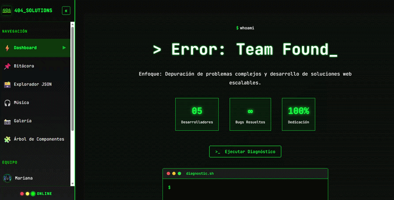
</p>

---

#### 1.2. Transiciones de Carga y Animaciones de Entrada (Home)

**Componentes:** `Home.jsx`, `HeroSection.jsx`, `TeamList.jsx` | **Hooks utilizados:** `useState`, `useEffect`

El Dashboard principal integra muchas secuencias de animación para simular el inicio de un sistema operativo, mejorando la percepción de rendimiento mediante retroalimentación visual antes de renderizar el DOM completo.

**Detalles de funcionalidad:**

- Estado de carga inicial (`isLoading`) controlado por temporizador.
- Animación de entrada escalonada para las 3 cajas de métricas (Desarrolladores, Bugs, Dedicación).
- Efecto visual tipo interferencia CRT (Glitch) al montar las tarjetas de los integrantes.
- Uso de `IntersectionObserver` para ejecutar las animaciones de las tarjetas únicamente cuando ingresan al viewport, evitando re-renders innecesarios.

```javascript
const [isLoading, setIsLoading] = useState(true);

useEffect(() => {
  // Simula el tiempo de carga del sistema
  const timer = setTimeout(() => setIsLoading(false), 800);
  return () => clearTimeout(timer);
}, []);
```

<p align="center">
  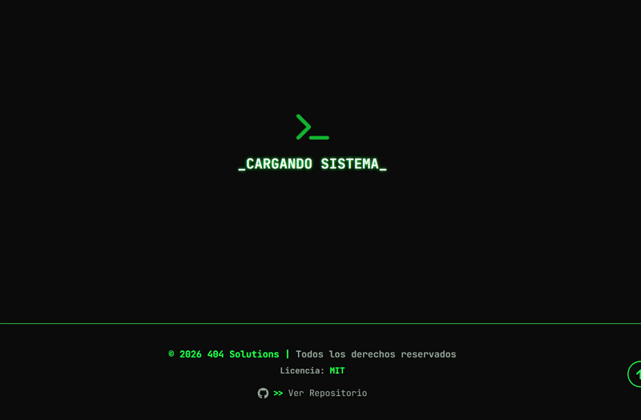
</p>

---

#### 1.3. Explorador de Datos JSON con Filtrado en Tiempo Real

**Componente:** `JsonExplorer.jsx` | **Hooks utilizados:** `useState`, `useEffect`

Se implementó un motor de búsqueda sobre datos estáticos (20 objetos consumidos desde `projects.json`) utilizando estados combinados de React. Los filtros se evalúan en tiempo real cada vez que el usuario interactúa, sin necesidad de recargar la página ni usar botones de envío.

**Detalles de funcionalidad:**

- Carga de datos dinámica desde un archivo JSON local.
- Búsqueda por texto (input) que filtra coincidencias en tiempo real.
- Filtro combinable por categoría mediante menú desplegable (select).
- Actualización instantánea del Virtual DOM al modificar cualquier filtro.
- Contador de resultados dinámico que refleja la cantidad exacta de tarjetas visibles.

```javascript
useEffect(() => {
  let result = projects.filter((project) =>
    project.title.toLowerCase().includes(searchTerm.toLowerCase()),
  );

  if (selectedCategory !== "Todas") {
    result = result.filter((project) => project.category === selectedCategory);
  }

  setFilteredProjects(result);
}, [searchTerm, selectedCategory, projects]);
```

<p align="center">
  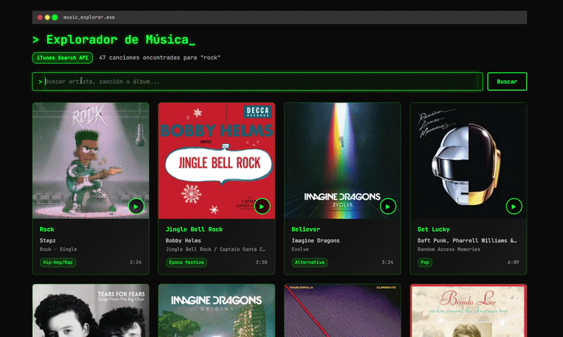
</p>

---

#### 1.4. Módulo de API Externa (iTunes) con Paginación

**Componente:** `ApiData.jsx` | **Hooks utilizados:** `useState`, `useEffect`, `useRef`

Se implementó el consumo asíncrono de la API pública de iTunes mediante `fetch`, integrando un sistema de paginación propio y manejo estricto del reproductor de audio nativo del navegador.

**Detalles de funcionalidad:**

- Control de estados de interfaz: carga (`loading`), errores (`error`) y resultados (`data`).
- Paginación matemática limitando la vista a 8 tarjetas por página, con botones de Anterior/Siguiente deshabilitables dinámicamente.
- Reproductor de audio de 30 segundos (preview).
- Función de _cleanup_ (limpieza) en `useEffect` combinada con `useRef` para garantizar que, si el usuario reproduce una canción y cambia de página o vista, el audio se detenga automáticamente y no quede sonando en segundo plano.

```javascript
// Cleanup para el audio al desmontar el componente o cambiar de vista
useEffect(() => {
  return () => {
    if (audioRef.current) {
      audioRef.current.pause();
      audioRef.current = null;
    }
  };
}, []);
```

<p align="center">
  
</p>

---

#### 1.5. Galería de Imágenes Interactiva con Lightbox

**Componente:** `Gallery.jsx` | **Hooks utilizados:** `useState`, `useEffect`

Se implementó un sistema de grilla con un visor modal (Lightbox) a pantalla completa. Se priorizó la accesibilidad y la experiencia de usuario (UX) integrando navegación nativa por teclado y bloqueo de scroll.

**Detalles de funcionalidad:**

- Renderizado dinámico de un Grid de imágenes responsivo.
- Apertura de modal al hacer clic, el cual bloquea automáticamente el scroll del fondo (`body`).
- Detección de eventos globales del teclado: tecla `ESC` para cerrar, y flechas `←` / `→` para navegar entre las imágenes.
- Prevención de fugas de memoria (_memory leaks_) utilizando la función de _cleanup_ del `useEffect` para remover los _event listeners_ del objeto `window` cuando el modal se cierra.

```javascript
useEffect(() => {
  const handleKeyDown = (e) => {
    if (e.key === "Escape") closeLightbox();
    if (e.key === "ArrowRight") goToNext();
    if (e.key === "ArrowLeft") goToPrevious();
  };

  // Agrega el listener global
  window.addEventListener("keydown", handleKeyDown);

  // Cleanup: remueve el listener al cerrar el lightbox o desmontar
  return () => window.removeEventListener("keydown", handleKeyDown);
}, [lightboxOpen]);
```

<p align="center">
  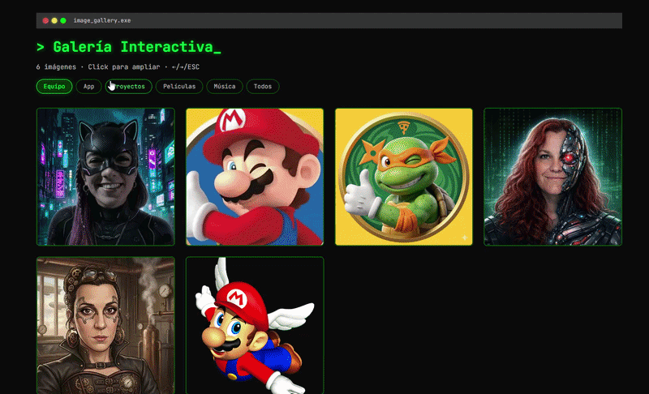
</p>

### 🔹 2. Funcionalidades Migradas a React (Base TP1)

Las siguientes funcionalidades fueron implementadas originalmente en el TP1 utilizando JavaScript y posteriormente integradas a la versión desarrollada con React mediante el uso de **Hooks**.

---

#### 2.1. Simulador de Diagnóstico (Consola Interactiva)

**Componente:** `HeroSection.jsx` | **Lógica:** `useState`, `setInterval`

- **Funcionalidad:** al hacer clic en el botón "Ejecutar Diagnóstico", simula una terminal ejecutando comandos de chequeo del sistema. El texto aparece progresivamente en pantalla (efecto máquina de escribir) y desactiva el botón mientras se ejecuta.
- **Migración a React:** la lógica original fue adaptada utilizando un arreglo de _strings_ y un `setInterval`. En lugar de manipular directamente el contenido mostrado en pantalla, se actualiza de forma progresiva un estado de React (`setCodeLines`), que renderiza cada línea de la terminal a medida que avanza la simulación.

<p align="center">
  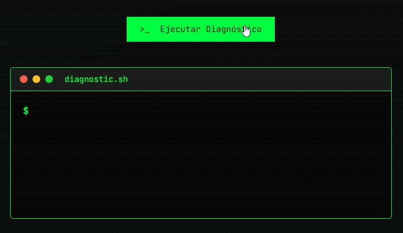
</p>

---

#### 2.2. Menú Hamburguesa (Mobile)

**Componente:** `Header.jsx` | **Hooks utilizados:** `useState`

- **Funcionalidad:** en resoluciones menores a 768px aparece un menú hamburguesa que, al presionarlo, despliega la navegación sobre el contenido (con un fondo oscurecido) y bloquea el desplazamiento de la página para facilitar la navegación en dispositivos móviles.
- **Migración a React:** el comportamiento del menú fue adaptado utilizando el estado booleano `menuOpen`, que controla de forma condicional las clases CSS aplicadas al menú de navegación. Esto reemplaza la manipulación manual del DOM utilizada en la versión desarrollada con JavaScript, lo que permite gestionar la apertura y cierre del menú directamente desde React.

<p align="center">
  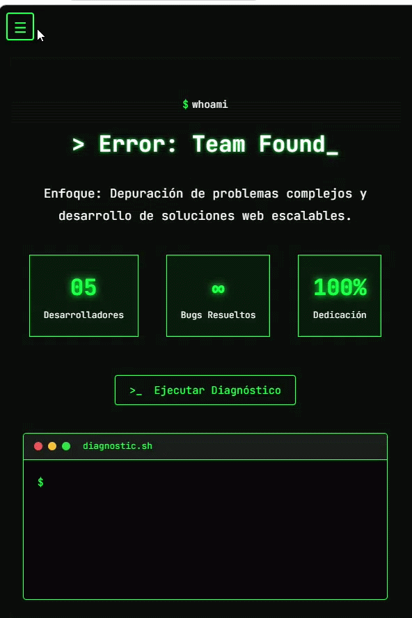
</p>

---

#### 2.3. Párrafos Expandibles ("Leer más / Leer menos")

**Componentes:** `MarioProfile.jsx`, `MikeProfile.jsx`, `ValeriaProfile.jsx` | **Hooks utilizados:** `useState`

- **Funcionalidad:** en las descripciones largas de películas o proyectos, trunca el texto y muestra un botón interactivo. Al hacer clic, el texto se expande empujando el contenido adyacente de forma fluida.
- **Migración a React:** en lugar de manipular clases CSS directamente sobre elementos del DOM, se utiliza un objeto de estado (`expandedMovies` o `expandedProjects`) para registrar qué tarjeta fue expandida (ID/Índice de la tarjeta activa). Esto permite actualizar el contenido correspondiente únicamente cuando el usuario interactúa con el botón.

<p align="center">
  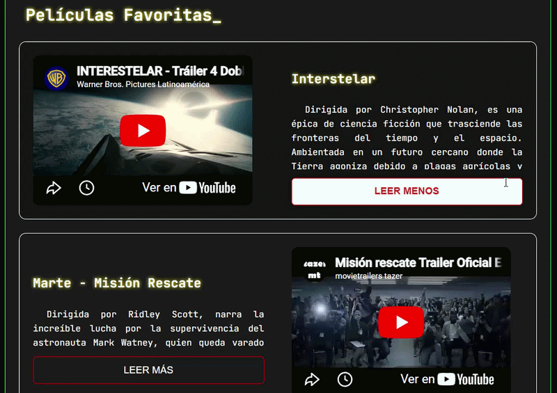
</p>

---

#### 2.4. Galería Dinámica de Películas

**Componente:** `MarianaProfile.jsx` | **Hooks utilizados:** `useState`

- **Funcionalidad:** muestra una galería de pósters de películas y, al seleccionar uno de ellos, se actualiza dinámicamente un contenedor principal con la información correspondiente (título, director, sinopsis y tráiler), sin necesidad de recargar la página.
- **Migración a React:** en la versión desarrollada con JavaScript la información de cada película se obtenía mediante atributos `data-*` asociados a los pósters. En esta versión, los datos se almacenan en un arreglo de objetos y el estado `selectedMovie` determina qué película se muestra en el contenedor principal, permitiendo que React actualice la interfaz de forma automática ante cada selección.

<p align="center">
  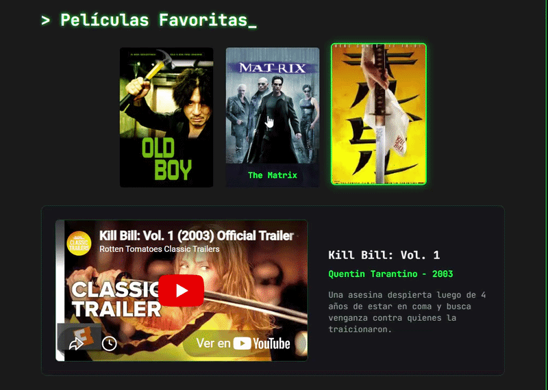
</p>

---

#### 2.5. Consola Interactiva de Base de Datos

**Componente:** `MikeProfile.jsx` | **Hooks utilizados:** `useState`, `useEffect` (Temporizadores)

- **Funcionalidad:** al hacer clic en la sección de habilidades de Data Science, se ejecuta una simulación de consola que representa una consulta a una base de datos. Los mensajes se muestran de forma progresiva, simulando el proceso de conexión y recuperación de información antes de presentar los resultados.

- **Migración a React:** la lógica fue adaptada utilizando el estado booleano `dsExecuted`, que determina cuándo deben mostrarse la animación de escritura y las respuestas simuladas de la consulta. De esta manera, la visualización de la consola queda controlada por el estado de React en lugar de depender de modificaciones directas sobre el DOM.

<p align="center">
  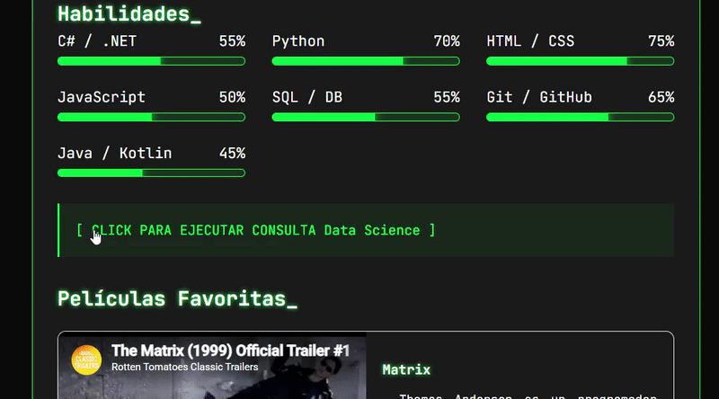
</p>

---

#### 2.6. Carruseles Interactivos de Proyectos y Discos

**Componentes:** Perfiles individuales | **Hooks utilizados:** `useState`

- **Funcionalidad:** slider horizontal que permite recorrer los distintos proyectos o discos favoritos mediante controles de navegación de "Anterior" y "Siguiente", actualizando dinámicamente el contenido mostrado en pantalla.
- **Migración a React:** la lógica de navegación fue adaptada utilizando un estado que almacena el índice del elemento seleccionado. En la versión desarrollada con JavaScript, el desplazamiento se realizaba mediante transformaciones visuales (`transform: translateX`), mientras que en React se actualiza el índice del elemento activo (por ejemplo, `setCurrentProject((prev) => (prev + 1) % projects.length)`), mostrando la información correspondiente a partir de los datos almacenados en el arreglo.

<p align="center">
  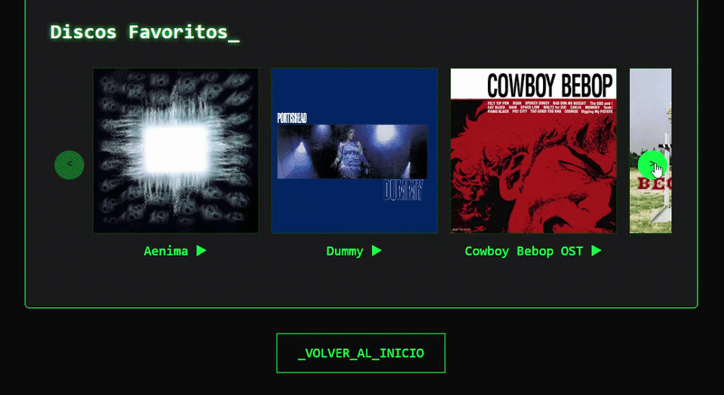
</p>
<p align="center">
  
</p>

---

#### 2.7. Navegación Interna (ScrollSpy)

**Componentes:** `RaquelProfile.jsx`, `MarianaProfile.jsx` | **Hooks utilizados:** `useState`, `useEffect`

**Funcionalidad:** a medida que el usuario hace scroll por el perfil, el submenú de navegación detecta automáticamente qué sección se encuentra visualizando y resalta el enlace correspondiente, brindando una referencia visual de ubicación durante la navegación.
**Migración a React:** la funcionalidad fue adaptada mediante un _event listener_ de scroll registrado dentro de un `useEffect`. La lógica evalúa dinámicamente si la posición vertical actual (`window.scrollY`) se encuentra dentro de los límites de cada sección (utilizando `offsetTop` y `offsetHeight`) y actualiza el estado `activeSection`, permitiendo resaltar automáticamente la opción correspondiente del submenú.

<p align="center">
  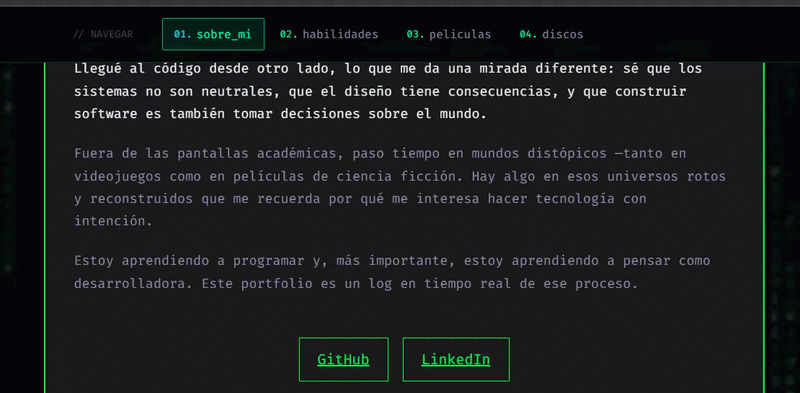
</p>

---

#### 2.8. Botón de Copiar URL

**Componente:** `RaquelProfile.jsx` | **Hooks utilizados:** `useState`

- **Funcionalidad:** Permite al usuario copiar el enlace directo del perfil al portapapeles con un solo clic, mostrando un mensaje temporal de confirmación "¡Enlace copiado!" para indicar que la acción se realizó correctamente.
- **Migración a React:** La funcionalidad fue adaptada utilizando la API `navigator.clipboard.writeText()` asociada al evento `onClick`. El mensaje de confirmación se controla mediante un estado booleano y se oculta automáticamente después de 2 segundos utilizando `setTimeout`.

<p align="center">
  
</p>

---

#### 2.9. Footer Dinámico (Año Automático)

**Componente:** `Footer.jsx` | **Lógica:** Expresiones de JS en JSX

- **Funcionalidad:** el año de copyright en el pie de página se actualiza automáticamente leyendo la fecha del sistema del usuario, lo que evita tener que mantener o modificar el código manualmente cada nuevo año.
- **Migración a React:** en React, el año se obtiene directamente mediante una expresión JavaScript dentro del JSX: `{new Date().getFullYear()}`. Esto elimina la necesidad de buscar y modificar elementos del DOM mediante IDs o clases, como ocurría en la implementación desarrollada con JavaScript.

<p align="center">
  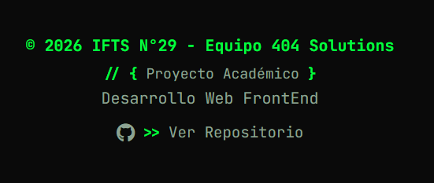
</p>

---

#### 2.10. Scroll Automático entre Rutas

**Componente:** `ScrollToTop.jsx` | **Hooks utilizados:** `useLocation`, `useEffect`

- **Funcionalidad:** al navegar entre las distintas secciones de la SPA, la vista vuelve automáticamente a la parte superior. Esto mejora la experiencia de usuario solucionando el problema nativo de retención de scroll que ocurre en las Single Page Applications.
- **Migración a React:** el componente escucha los cambios de ruta mediante `useLocation`. Cada vez que cambia la ruta activa, se ejecuta un `useEffect` que llama al método nativo `window.scrollTo(0, 0)`, reposicionando automáticamente la vista al inicio de la página.

---

## 🌳 Árbol de Renderizado (Arquitectura de Componentes)

### Diagrama Jerárquico

```text
App (ROOT)
│
├── BrowserRouter
│   │
│   ├── ScrollToTop (Utility Component)
│   │
│   ├── Header (Layout Global Mobile - Renderizado condicional < 768px)
│   │
│   ├── Sidebar (Layout Global - Navegación Dashboard)
│   │   ├── Logo + Toggle Button
│   │   ├── Navigation Menu (Links a Vistas Principales)
│   │   │   ├── ⚡ Dashboard (Home)
│   │   │   ├── 📌 Bitácora
│   │   │   ├── 🗃️ Explorador JSON
│   │   │   ├── 🎧 Música (iTunes API)
│   │   │   ├── 📸 Galería
│   │   │   └── 🧩 Árbol de Componentes
│   │   ├── Team Members Links (Links a Perfiles individuales)
│   │   │   ├── Mariana
│   │   │   ├── Mario
│   │   │   ├── Mike
│   │   │   ├── Raquel
│   │   │   └── Valeria
│   │   └── Footer Indicator (Online Status)
│   │
│   └── Main Content (Layout Container)
│       │
│       ├── Routes (React Router)
│       │   │
│       │   ├── Route: "/" → Home
│       │   │   ├── HeroSection
│       │   │   │   ├── Terminal Prompt
│       │   │   │   ├── Hero Title
│       │   │   │   ├── Stats Display
│       │   │   │   └── Diagnostic Button
│       │   │   └── TeamList
│       │   │       └── Team Cards (x5)
│       │   │
│       │   ├── Route: "/bitacora" → Bitacora
│       │   │
│       │   ├── Route: "/json-explorer" → JsonExplorer
│       │   │   ├── Search Input
│       │   │   ├── Filter Selects
│       │   │   └── Project Cards Grid
│       │   │
│       │   ├── Route: "/api-data" → ApiData
│       │   │   ├── Music Cards Grid
│       │   │   └── Pagination Controls
│       │   │
│       │   ├── Route: "/gallery" → Gallery
│       │   │   ├── Image Grid
│       │   │   └── Lightbox Modal
│       │   │
│       │   ├── Route: "/component-tree" → ComponentTree
│       │   │   ├── Tree Diagram
│       │   │   ├── Components Table
│       │   │   └── Data Flow Diagram
│       │   │
│       │   └── Routes: "/[member]" → Profile Pages
│       │       ├── MarianaProfile
│       │       ├── MarioProfile
│       │       ├── MikeProfile
│       │       ├── RaquelProfile
│       │       └── ValeriaProfile
│       │
│       └── Footer (Layout)
│           └── Copyright + Dynamic Year
```

### Tipos de Componentes

| Tipo          | Descripción                           | Ejemplos                                                                     |
| ------------- | ------------------------------------- | ---------------------------------------------------------------------------- |
| **Root**      | Componente raíz de la aplicación      | `App.jsx`                                                                    |
| **Layout**    | Componentes de estructura persistente | `Sidebar.jsx`, `Header.jsx`, `Footer.jsx`                                    |
| **Page**      | Componentes de vista/página           | `Home.jsx`, `Bitacora.jsx`, `JsonExplorer.jsx`, `ApiData.jsx`, `Gallery.jsx` |
| **Component** | Componentes reutilizables             | `HeroSection.jsx`, `TeamList.jsx`, `SkillBar.jsx`, `AdvancedBar.jsx`         |
| **Utility**   | Componentes sin UI (lógica)           | `ScrollToTop.jsx`                                                            |

### Flujo de Datos

1. **Router** → `BrowserRouter` gestiona las rutas y la navegación del lado del cliente.
2. **Layout** → `Sidebar`, `Header` y `Footer` se mantienen visibles en todas las vistas, proporcionando una estructura común de navegación, sin recargas desde cero.
3. **Pages** → Los componentes de página se cargan y desmontan dinámicamente según la ruta activa.
4. **Components** → Los componentes hijos reciben `props` y manejan su estado local e interactividad con Hooks.

---

## 📈 Evolución del Proyecto (TP1 → TP2)

### Cambios Principales

#### De HTML/CSS/JS Vanilla a React

**ANTES (TP1):**

- Múltiples archivos HTML (`index.html`, `mariana.html`, `mario.html`, etc.)
- JavaScript vanilla con manipulación directa y manual del DOM
- Código repetitivo en cada página (Header y Footer duplicados 5 veces).
- Navegación con recarga completa de página al cambiar de vista.
- Sin gestión de estado centralizada.

**DESPUÉS (TP2):**

- Single Page Application (SPA) renderizada desde un solo `index.html`.
- Arquitectura basada en Componentes React reutilizables.
- Estado manejado dinámicamente con React Hooks (`useState`, `useEffect`).
- Navegación fluida del lado del cliente sin recargas mediante React Router.
- Código modular, escalable y fácil de mantener

---

### Mejoras Implementadas

#### 1. Componentización

**Antes:** código HTML estructural duplicado en cada página.

```html
<!-- Repetido en cada archivo HTML -->
<header>
  <nav>...</nav>
</header>
```

**Después:** abstracción en componentes reutilizables.

```jsx
// Declarado una sola vez y renderizado en el Layout principal
<Sidebar />
<Header />
```

---

#### 2. Gestión de Estado

**Antes:** variables globales y manipulación forzadadel DOM.

```javascript
let menuOpen = false;
document.getElementById("menu").style.display = "block";
```

**Después:** flujo reactivo con Hooks.

```javascript
const [menuOpen, setMenuOpen] = useState(false);
// React actualiza el DOM automáticamente al cambiar el estado
```

---

#### 3. Routing y Navegación

**Antes:** enlaces tradicionales con recarga de navegador.

```html
<a href="mariana.html">Ver perfil</a>
```

**Después:** React Router

```jsx
<Link to="/mariana">Ver perfil</Link>
```

---

#### 4. Performance y Optimización

- **Vite**: reemplazo del desarrollo estático por un servidor de desarrollo con HMR (Hot Module Replacement).
- **Code Splitting**: empaquetado automático y optimizado para producción.
- **Assets**: Minificación y compresión automática de recursos estáticos.

---

#### 5. Arquitectura

**Antes:** estructura plana básica (`/css`, `/js`, archivos `.html` sueltos).

```text
/
├── index.html
├── mariana.html
├── mario.html
├── styles.css
└── script.js
```

**Después:** estructura modular estándar de React

```text
/src
├── components/    # Componentes de UI reutilizables
├── pages/         # Vistas/páginas de enrutamiento
├── styles/        # Estilos globales y variables css
├── App.jsx        # Configuración de rutas (Layout)
└── main.jsx       # Entry point
```

---

### Nuevas Funcionalidades (Exclusivas del TP2)

| Funcionalidad            | Descripción                                                         | Tecnología / Hooks                        |
| :----------------------- | :------------------------------------------------------------------ | :---------------------------------------- |
| **Sidebar Dashboard**    | Navegación lateral fija con estado colapsable.                      | `useState`, `useLocation`                 |
| **Explorador JSON**      | Búsqueda y filtrado multicriterio en tiempo real.                   | `useState`, `useEffect`                   |
| **API Externa (iTunes)** | Consumo asíncrono con paginación y reproducción de audio.           | `fetch`, `useState`, `useRef`             |
| **Galería Lightbox**     | Modal fullscreen con accesibilidad por teclado y bloqueo de scroll. | `useState`, `useEffect` (Event Listeners) |
| **Transiciones y Carga** | Simulador de carga inicial en el Home.                              | `setTimeout`, `useState`                  |
| **Animaciones Glitch**   | Efectos de entrada al cargar las tarjetas de integrantes.           | CSS Animations, `IntersectionObserver`    |
| **Árbol de Componentes** | Documentación visual interactiva de la arquitectura del proyecto.   | React Component                           |

---

### Desafíos Encontrados y Lecciones Aprendidas

1. **Gestión de Efectos Secundarios (Memory Leaks):**
   - _Desafío:_ al reproducir una canción en la API y cambiar de página, el audio seguía sonando. Lo mismo ocurría con los eventos del teclado en la Galería, que se multiplicaban.
   - _Solución:_ se incorporaron funciones de _cleanup_ dentro de los `useEffect` (mediante `return () => ...`) para liberar recursos al desmontar componentes, junto con el uso de `useRef` para gestionar referencias del DOM cuando fue necesario.

2. **Curva de Aprendizaje de React:**
   - _Desafío:_ cambiar el modelo mental de "seleccionar y modificar el DOM" a "declarar estados que la UI debe reflejar".
   - _Solución:_ lectura de documentación oficial y práctica mediante refactorizaciones progresivas y comprensión del funcionamiento de los estados, efectos y ciclo de vida de los componentes.

3. **Contexto de Enrutamiento:**
   - _Desafío:_ errores de tipo `useLocation() may be used only in the context of a <Router>`.
   - _Solución:_ se reestructuró el Árbol de Componentes para asegurar que utilidades como `ScrollToTop` y `Sidebar` estén siempre anidadas dentro de `<BrowserRouter>` en `App.jsx`.

4. **Conflictos de Estilos Globales:**
   - _Desafío:_ evitar que las clases CSS de un componente afecten a otro al estar todo renderizado en una misma SPA.
   - _Solución:_ se utilizaron nombres de clases más específicos y se reorganizaron algunos selectores CSS para aislar mejor los estilos de cada componente.

### Desafíos Encontrados

1. **Curva de Aprendizaje**
   - Conceptos de React: componentes, props, state, hooks
   - Ciclo de vida de componentes
   - **Solución:** Documentación oficial, práctica iterativa

2. **Gestión de Estado**
   - Decidir cuándo usar estado local vs props
   - Evitar re-renders innecesarios
   - **Solución:** Uso correcto de useState y useEffect

3. **Routing**
   - Configuración de rutas en SPA
   - **Solución:** Documentación de React Router

4. **Estilos**
   - Evitar conflictos de nombres de clases CSS entre componentes
   - **Solución:** Clases con prefijos específicos por componente

---

## 🤖 Uso de Inteligencia Artificial

Durante el desarrollo del proyecto se utilizaron distintas herramientas de Inteligencia Artificial como apoyo para consultas técnicas, resolución de problemas, generación de contenido y documentación. La IA fue usada como una herramienta de asistencia durante el proceso de desarrollo, mientras que las decisiones de diseño, arquitectura, implementación y validación final fueron realizadas por el equipo.

### Herramientas de IA Utilizadas

#### 1. **ChatGPT (GPT-4)**

- **Proveedor:** OpenAI
- **Uso principal:**
  - Generación y mejora de documentación.
  - Consultas sobre React, Hooks y buenas prácticas.
  - Asistencia en debugging y resolución de errores.

#### 2. **Claude (Sonnet 4.6)**

- **Proveedor:** Anthropic
- **Uso principal:**
  - Análisis de código.
  - Revisión de lógica y propuestas de refactorización.
  - Ayuda en la redacción técnica del README.

#### 3. **GitHub Copilot**

- **Proveedor:** GitHub (powered by OpenAI)
- **Uso principal:**
  - Autocompletado de código.
  - Sugerencias de funciones y estructuras repetitivas.
  - Asistencia durante la implementación de componentes React.

#### 4. **Gemini (Pro) **

- **Proveedor:** Google
- **Uso principal:**
  - Consultas técnicas complementarias.
  - Comparación de enfoques de implementación.
  - Apoyo en tareas de documentación y revisión.

#### 5. **DALL-E 3 y Gemini Flash Image**

- Generación e intervención de imágenes utilizadas en los perfiles de integrantes.

---

### Uso en Código y Desarrollo

Las herramientas de IA fueron utilizadas principalmente para validar enfoques de implementación, resolver dudas técnicas y detectar posibles errores durante el desarrollo.

Algunos ejemplos concretos fueron:

#### Ejemplo 1: Lógica de Paginación

Se consultaron herramientas de IA para validar la lógica matemática utilizada para dividir los resultados obtenidos desde la API externa en múltiples páginas.

```javascript
// Sugerido por GitHub Copilot, adaptado por el equipo
const totalPages = Math.ceil(tracks.length / itemsPerPage);
const indexOfLastItem = currentPage * itemsPerPage;
const indexOfFirstItem = indexOfLastItem - itemsPerPage;
const currentItems = tracks.slice(indexOfFirstItem, indexOfLastItem);
```

---

#### Ejemplo 2: Manejo de Eventos de Teclado en el Lightbox

Se utilizaron consultas a IA para comprender el uso correcto de useEffect, el registro de eventos y las funciones de limpieza (cleanup) necesarias para evitar comportamientos no deseados.

```javascript
// ChatGPT ayudó con la estructura del useEffect
useEffect(() => {
  const handleKeyDown = (e) => {
    if (!lightboxOpen) return;
    switch (e.key) {
      case "Escape":
        closeLightbox();
        break;
      case "ArrowRight":
        goToNext();
        break;
      case "ArrowLeft":
        goToPrevious();
        break;
    }
  };
  window.addEventListener("keydown", handleKeyDown);
  return () => window.removeEventListener("keydown", handleKeyDown);
}, [lightboxOpen]);
```

---

#### Ejemplo 3: Filtrado Dinámico de Datos (en tiempo real)

Se usó la IA para revisar alternativas de implementación y optimización de filtros encadenados sobre colecciones de datos.

```javascript
// Claude ayudó a optimizar la lógica de filtros encadenados
useEffect(() => {
  let result = projects;
  if (searchTerm) {
    result = result.filter(
      (project) =>
        project.title.toLowerCase().includes(searchTerm.toLowerCase()) ||
        project.description.toLowerCase().includes(searchTerm.toLowerCase()),
    );
  }
  if (selectedCategory !== "Todas") {
    result = result.filter((project) => project.category === selectedCategory);
  }
  setFilteredProjects(result);
}, [searchTerm, selectedCategory, projects]);
```

---

### Uso en Contenido y Documentación

Además del código, se utilizaron herramientas de IA para:

- Redacción inicial de algunas secciones del README.
- Mejora de explicaciones técnicas y descripciones de funcionalidades.
- Revisión de textos para lograr mayor claridad y organización.
- Generación de ejemplos y textos de prueba utilizados durante el desarrollo.

Todos los textos fueron posteriormente revisados, corregidos y adaptados por los integrantes del equipo.

---

### Uso en Imágenes

Para preservar la privacidad de los integrantes se mantuvo el criterio utilizado en la primera entrega del proyecto, reemplazando o modificando fotografías personales mediante herramientas de generación y edición de imágenes con IA. Los avatares fueron creados o intervenidos utilizando DALL-E 3 y Gemini Flash Image, siguiendo una estética común inspirada en:

- Terminales de consola.
- Cyberpunk.
- Retrocomputación.
- Ciencia ficción.
- Videojuegos clásicos.

**Ejemplos** de criterios de prompts utilizados

- "Editar una fotografía para convertirla en un personaje cyberpunk con iluminación verde y violeta sobre fondo oscuro."
- "Transformar una imagen incorporando elementos robóticos inspirados en ciencia ficción."
- "Generar un avatar 3D inspirado en videojuegos clásicos con estética tecnológica."
- "Modificar una fotografía manteniendo la identidad visual del integrante pero adaptándola a una temática retro-futurista."

---

### Reflexión sobre el Uso de IA

La Inteligencia Artificial fue utilizada como una herramienta de apoyo durante el desarrollo del proyecto y no como un reemplazo del trabajo realizado por el equipo.

- Todas las sugerencias fueron revisadas antes de incorporarse.
- El código utilizado fue comprendido, adaptado y probado por los integrantes.
- Las decisiones de diseño y arquitectura fueron tomadas por el equipo.
- La IA se utilizó como complemento para acelerar tareas de consulta, documentación y resolución de problemas puntuales.

De esta manera, la IA actuó como una herramienta de asistencia dentro del proceso de aprendizaje, manteniendo la autoría y responsabilidad del proyecto en manos de los estudiantes.

---

## 🤝 Contribuciones

### Roles del Equipo

| Integrante              | Rol Principal               | Contribuciones TP2                                                                                                                                                   |
| :---------------------- | :-------------------------- | :------------------------------------------------------------------------------------------------------------------------------------------------------------------- |
| **Mariana Aiello**      | Software Dev & Data Science | Perfil individual, componente AdvancedBar animado, Explorador JSON (filtrado y búsqueda en tiempo real), Documentación y estructuración del README. |
| **Mario González**      | Full Stack Developer        | Perfil individual, Sidebar Dashboard fija (menú, responsive, hamburguesa), Configuración de React Router y estructura de rutas base, componente SkillBar animado.    |
| **Miguel Ángel Flores** | Full Stack Developer        | Perfil individual, Módulo API externa (iTunes) con paginación y manejo de estados de carga/error, Setup inicial del proyecto.                                        |
| **Raquel Rodríguez**    | Front End Developer         | Perfil individual, Galería de imágenes con Lightbox (efecto zoom, navegación por teclado), Estilos globales, animaciones y maquetación general, página de Bitácora.  |
| **Valeria Thomas**      | Full Stack Developer        | Perfil individual, Panel central Dashboard Home (TeamList, HeroSection, animaciones de entrada), Árbol de Componentes, Deploy en Vercel.                             |

### Metodología de Trabajo

- **Control de versiones**: se utilizó GitHub como repositorio central del proyecto.
- **Estrategia de ramas**: el desarrollo se organizó mediante una rama principal (main), una rama de integración (develop) y ramas específicas para distintas funcionalidades y mejoras antes de incorporarlas al proyecto principal.
- **Integración de cambios**: las funcionalidades desarrolladas por cada integrante fueron integradas progresivamente al proyecto mediante procesos de merge entre ramas.
- **Pruebas y validación**: cada funcionalidad fue probada localmente durante el desarrollo y posteriormente verificada en el entorno desplegado en Vercel.
- **Documentación**: el README fue actualizado durante el avance del proyecto para reflejar la evolución de la aplicación, las decisiones técnicas adoptadas y las funcionalidades implementadas.
- **Comunicación del equipo**: la coordinación de tareas, resolución de problemas y seguimiento del proyecto se realizó mediante comunicación continua entre los integrantes.

---

## 🚀 Instalación y Ejecución

### Requisitos Previos

- **Node.js** 18.0.0 o superior
- **npm** 9.0.0 o superior
- **Git**

### Pasos de Instalación

```bash
# 1. Clonar el repositorio
git clone https://github.com/raquerh/404Solutions_FE.git

# 2. Entrar al directorio
cd 404Solutions_FE

# 3. Instalar dependencias
npm install

# 4. Iniciar servidor de desarrollo
npm run dev

# 5. Abrir en el navegador
# http://localhost:5173
```

### Scripts Disponibles

```bash
npm run dev       # Servidor de desarrollo con HMR
npm run build     # Compila para producción (carpeta dist/)
npm run preview   # Vista previa del build de producción
npm run lint      # Ejecuta ESLint
```

---

## 🚀 Deploy en Vercel

### Pasos para Desplegar

1. Ir a [vercel.com](https://vercel.com) y hacer Sign up con GitHub
2. Click en "New Project" → Import Git Repository → Seleccionar `404Solutions_FE`
3. Configurar:

   ```
   Framework Preset: Vite
   Build Command: npm run build
   Output Directory: dist
   Install Command: npm install
   ```

4. Click en "Deploy"
5. Cada push a `main` despliega automáticamente

---

## Funcionalidades Completadas (Checklist TP2)

### Requerimientos Obligatorios

Esta sección resume el grado de cumplimiento de los requerimientos obligatorios establecidos en la consigna del Trabajo Práctico 2.

#### ✅ 1. Navegación Estilo Dashboard (Sidebar Fija)

- [x] Sidebar lateral fija siempre visible
- [x] Logo del grupo integrado
- [x] Menú de navegación jerarquizado (NAVEGACIÓN + EQUIPO)
- [x] Estética de Dashboard profesional
- [x] Responsive (colapsa en mobile)

#### ✅ 2. Panel Central de Presentación (Dashboard Home)

- [x] Grilla dinámica de tarjetas de integrantes
- [x] Nombre y avatar en cada tarjeta
- [x] Animaciones de entrada CRT escalonadas
- [x] HeroSection con simulador de diagnóstico interactivo
- [x] Transiciones suaves de carga inicial

#### ✅ 3. Sección Individual por Integrante (5 perfiles)

- [x] Vista detallada para cada integrante
- [x] Información personal y descripción
- [x] Barras de progreso animadas
- [x] Mínimo 5 iconos de tech stack con efectos hover (DevIcons)
- [x] Carrusel de proyectos interactivo (mínimo 3 por integrante)
- [x] Botones de redes sociales con efectos hover

#### ✅ 4. Explorador de Datos Locales (JSON)

- [x] Archivo JSON con 20 objetos
- [x] Renderización dinámica
- [x] Filtrado en tiempo real
- [x] Buscador por texto
- [x] Actualización dinámica de vista

#### ✅ 5. Módulo de Integración de API Externa

- [x] Consumo asíncrono de iTunes Search API (sin API key)
- [x] Buscador de música en tiempo real
- [x] Portadas de álbum + preview de audio 30s
- [x] Manejo de estados (loading, error, success)
- [x] Sistema de paginación (8 items por página)
- [x] Indicador de posición actual

#### ✅ 6. Galería de Imágenes Interactiva

- [x] Grid responsive de imágenes
- [x] Lightbox integrado (modal fullscreen)
- [x] Efecto de zoom al ampliar la imagen
- [x] Navegación interna (anterior/siguiente)
- [x] Cierre con tecla ESC
- [x] Animaciones de apertura/cierre

#### ✅ 7. Sección Bitácora de Proyecto

- [x] Tabla de roles del equipo con contribuciones
- [x] Flujo de trabajo (Git branches, code review)
- [x] Justificación de migración HTML/JS → React
- [x] Mejoras técnicas con ejemplos de código
- [x] Desafíos encontrados y lecciones aprendidas

#### ✅ 8. Sección Árbol de Renderizado

- [x] Representación gráfica del árbol de componentes
- [x] Estructura jerárquica detallada
- [x] Tipos y relaciones de componentes documentados

---

## Recursos y Referencias

### Documentación Oficial consultada

- [React Docs](https://react.dev/)
- [React Router](https://reactrouter.com/)
- [Vite](https://vitejs.dev/)
- [MDN Web Docs](https://developer.mozilla.org/)

### Recursos utilizados

- [Google Fonts](https://fonts.google.com/)
- [DevIcons](https://devicon.dev/)
- [Font Awesome](https://fontawesome.com/)
- [iTunes Search API](https://developer.apple.com/library/archive/documentation/AudioVideo/Conceptual/iTuneSearchAPI/)

---

## 🎓 Información Académica

**Institución:** IFTS N°29

**Carrera:** Tecnicatura en Desarrollo de Software

**Materia:** Desarrollo Web FrontEnd

**Trabajo Práctico:** TP2 - Proyecto React en Equipo

**Fecha de Entrega:** 01/06/2026

---

<div align="center">

MIT License - IFTS N°29 - Desarrollo Web FrontEnd

</div>
